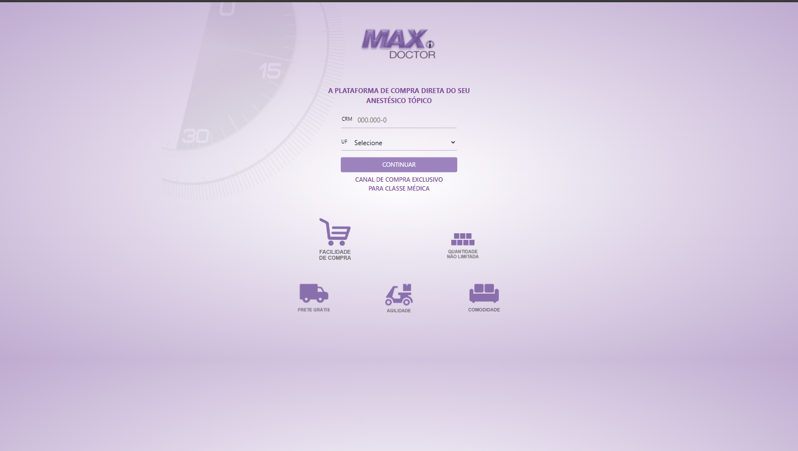
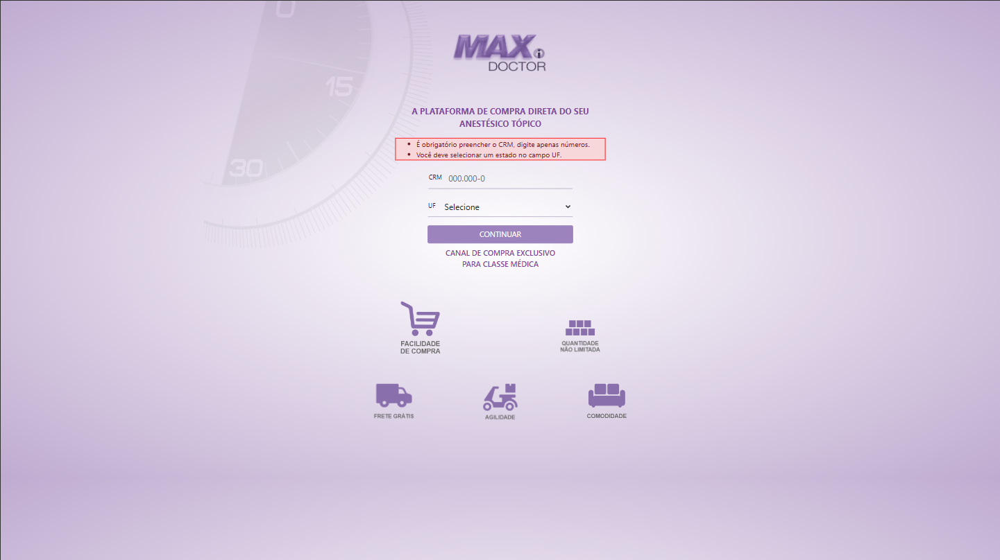
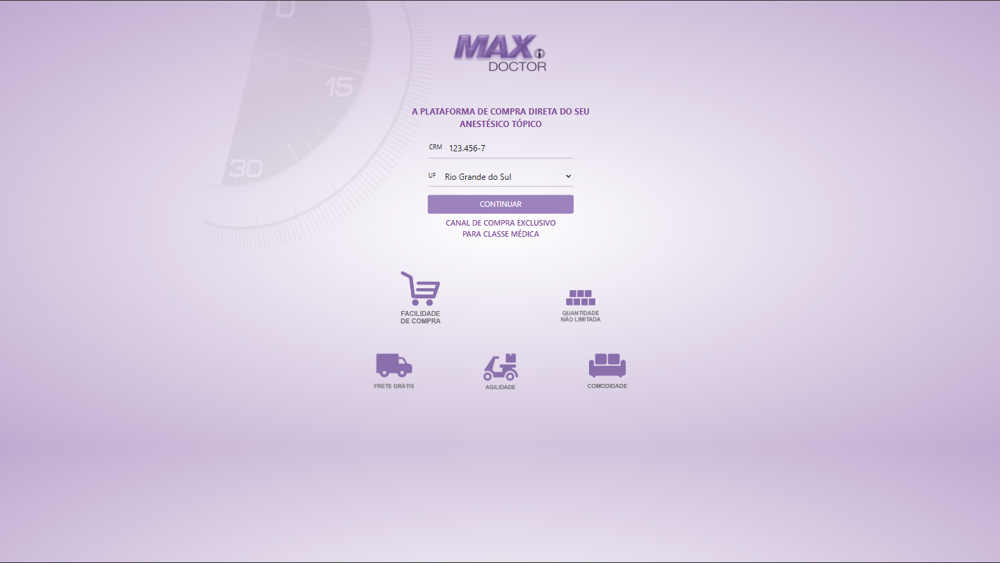
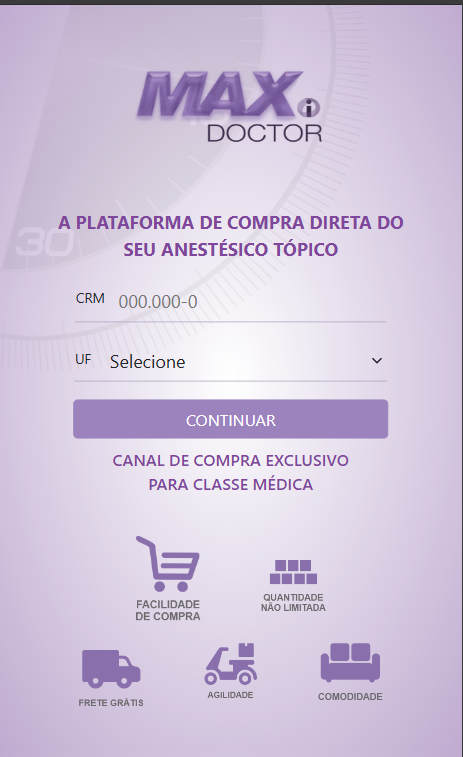

# hackathon-clone-layout
Hackathon com foco em reproduzir um layout, faça um fork deste projeto para começar.

## Objetivos
- [ ] Implementar o layout disponibilizado em resources
- [ ] O layout deve ser responsivo
- [ ] Deve conter uma mascara para o campo CRM
- [ ] Deve conter feedback informativo para erros (Pode-se utilizar o próprio do Bootstrap)
- [ ] Deve conter popups/alerts/toasts informativos (Sucesso e Redirecionamento)
- [ ] Utilize Bootstrap e outras libs para ajudar
- [ ] Ao preencher o formulário, e realizar um submit o usuário deve ser notificado através dos popups e ser redirecionado para uma site qualquer.

## Layout

### Layout Base

### Layout Formulário com Erros

### Layout com Formulário Preenchido

### Layout Popups/Toasts/Alerts

### Layout Responsivo

# BOA SORTE :D